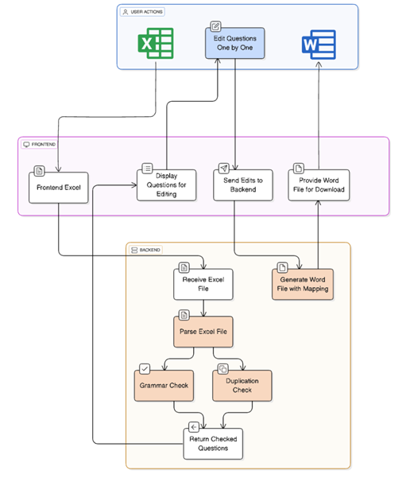
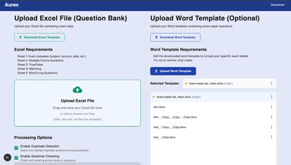
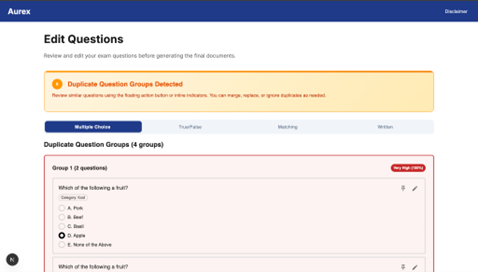
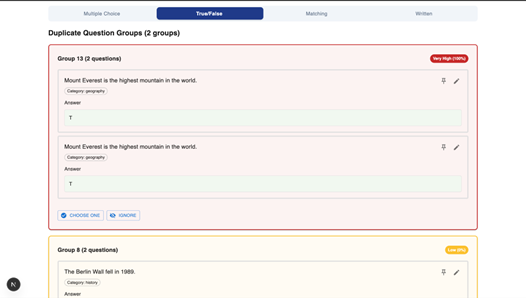
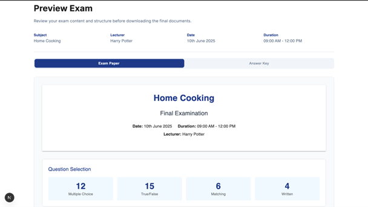
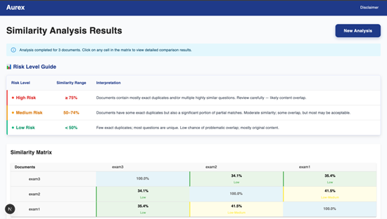

# AUREX — Exam Paper Generation System

> **"Smart · Secure · Effortless"** — An intelligent exam paper generation system built for course coordinators at Assumption University Thailand.

---

## 🧩 Overview

At Assumption University, many courses are taught across multiple sections by different lecturers. Each lecturer submits questions, and the course coordinator must merge them into a single fair, balanced, and non-repetitive exam — manually checking for duplicates, fixing grammar, and formatting everything from scratch. For a large course, this takes around **4 hours every exam cycle**.

AUREX replaces this entirely with a semi-automated pipeline:

- **Web Application** (Next.js) — for coordinators to upload question banks, curate questions, and export final exam papers
- **NLP Backend** (Flask) — handles duplicate detection, grammar checking, and Word document generation entirely offline

---

## ✨ Key Features

**Question Bank Processing**
- Upload Excel-based question banks from multiple lecturers
- Supports 5 question types: Multiple Choice, True/False, Matching, Short Answer, Essay
- Configurable duplicate detection and grammar checking per session

**NLP-Powered Quality Assurance**
- 3-tier duplicate detection: TF-IDF pre-filtering → weighted multi-modal scoring (Sentence-BERT, Jaccard, keyword overlap) → Union-Find clustering
- Local LanguageTool grammar checking — fully offline, no external API calls
- Color-coded duplicate risk indicators (Very High / High / Moderate) with suggested replacements

**Interactive Question Editor**
- Pin questions to lock them through any shuffle
- Shuffle unpinned questions intelligently by chapter and category
- Inline question editing: text, answer choices, correct answer, image upload
- Fake answer management for Matching questions

**Template-Driven Export**
- Upload custom Word templates with Jinja2 placeholders
- Generates both exam paper and answer key as `.docx` files
- Multiple templates supported; set any as default

**Exam Paper Similarity Checker**
- Upload previous exam papers to compare across semesters
- Similarity matrix heat map with drill-down per question pair
- Helps maintain question uniqueness and academic integrity

---

## 🛠 Tech Stack

| Layer | Technology |
|---|---|
| Frontend | Next.js, React, TypeScript |
| Backend | Python, Flask |
| NLP — Lexical | scikit-learn (TF-IDF, cosine similarity) |
| NLP — Semantic | Sentence Transformers (all-MiniLM-L6-v2) |
| NLP — Text Processing | NLTK (tokenization, stemming, stopwords) |
| Grammar Checking | language-tool-python (local LanguageTool) |
| Document Generation | docxtpl, Jinja2 |
| Data Processing | Pandas |

---

## 🏗 System Architecture

---

## 📸 Screenshots

### Upload & Configuration

### Question Editor

### Preview & Export

### Exam Similarity Checker

---

## 👥 Team

Collaborated with **Khant Min Lwin** and **Thet Myat Noe Thwin**  
Advised by **Asst. Prof. Dr. Rachsuda Setthawong**  
Assumption University Thailand — Senior Project 1 (1/2025)

---

## 📄 License

Academic Use Only — Assumption University Thailand, 2025
